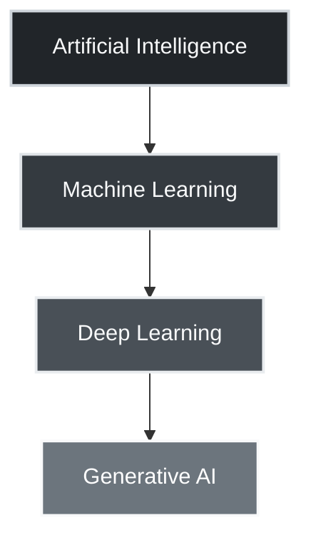
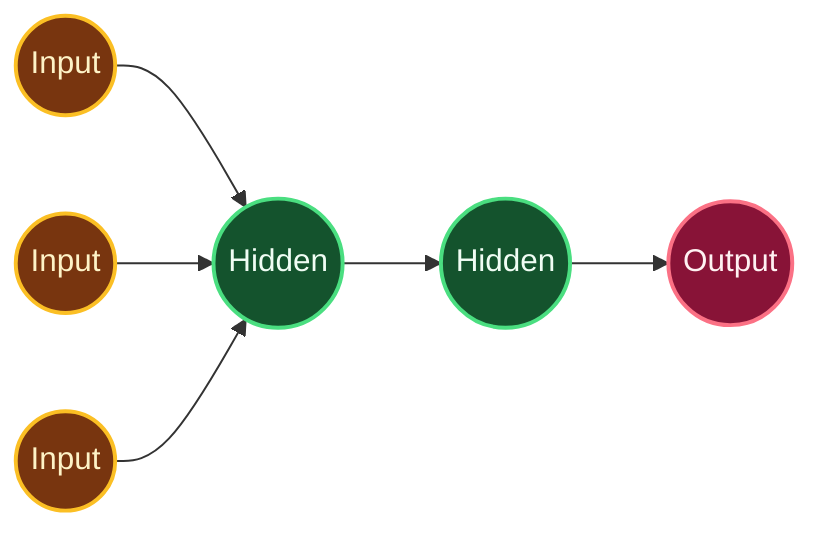
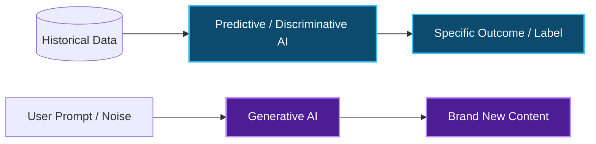
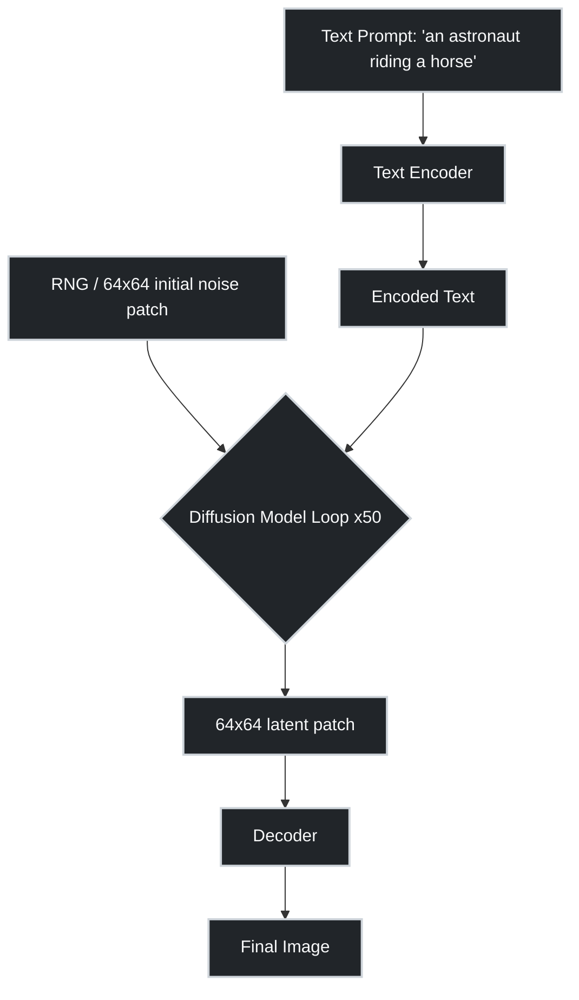
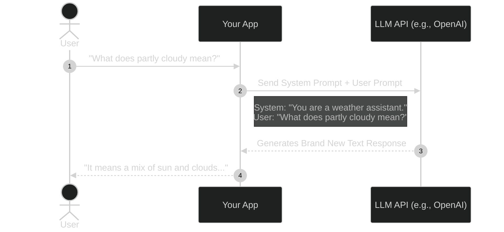

## 1. The Artificial Intelligence Hierarchy & Neural Networks

Understanding the exact boundaries between AI subsets is a common exam topic.

* **Artificial Intelligence (AI):** Emulates human behavior to make decisions and solve problems.
* **Machine Learning (ML):** Uses algorithms to learn from large datasets without explicit programming.
* **Deep Learning (DL):** Uses multiple layers of artificial neural networks to extract high-level features.
* **Generative AI:** A subset of DL that generates brand-new content (text, images, code).

### Neural Network Architecture

* **Input Layer:** Receives the raw data.
* **Hidden Layers:** Intermediate layers where the actual processing/pattern recognition happens.
* **Output Layer:** Delivers the final prediction or generation.

## 2. AI Paradigms

Expect multiple-choice or short-answer questions asking you to categorize a specific AI task.

| **Paradigm** | **Goal** | **Output** | **Exam Examples** |
| --- | --- | --- | --- |
| **Discriminative** | Classify existing data into categories. | Discrete labels (e.g., cat vs. dog). | Spam detection, fraud detection. |
| **Predictive** | Predict future values based on past data. | Continuous/Categorical (e.g., stock price). | Weather forecasting, sales prediction. |
| **Generative** | Generates entirely new data. | New content (e.g., images, text, videos). | Text generation, image synthesis. |

## 3. Core LLM Concepts & Diffusion Models

You must know the terminology that defines how models operate.

* **Parameters:** The parts of the model that it learns during training. Think of this as the model's "brain capacity" (e.g., GPT-3 has 175 billion parameters).
* **Context Window:** The model's "short-term memory." It is the amount of text it can read and understand at one time, measured in **tokens**.

### Diffusion Models (Image Generation)

This is how image generators process prompts.

## 4. The Model Lifecycle

Be able to distinguish between these four stages of model development.

1. **Training:** The model learns patterns by adjusting parameters using massive datasets and high compute power.
2. **Inference:** Using the trained model to get predictions. This is much faster and happens on your device or a server.
3. **Fine-Tuning:** Taking a pre-trained model and training it further on a specific, domain-focused task to customize behavior.
4. **Distillation:** Compresses a large model (teacher) into a smaller one (student) for faster, lighter, and cheaper deployment.

## 5. Technical Implementation: App Integration Workflow

When developing an application, integrating a Generative AI model looks fundamentally different from a normal API call.

> [!IMPORTANT]
> **Open vs. Closed Models:** Open models (LLaMA, Mistral) have publicly available weights and code. Closed models (GPT-4, Gemini) have proprietary and controlled access.

## Active Recall Self-Check

> [!TIP] Fine-tuning adjusts a pre-trained model to specialize in a specific task. Distillation shrinks a large model into a smaller, more efficient one to save computational resources.

> [!TIP] Parameters act as the model's memory learned during training. The Context Window acts as the short-term memory (how much of the current text it can read at once).

> [!TIP] 1. Input Layer 2. Hidden Layers 3. Output Layer
