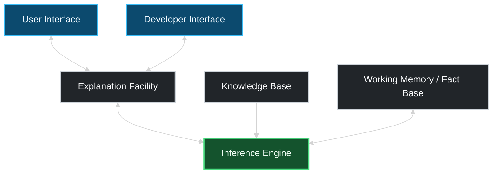
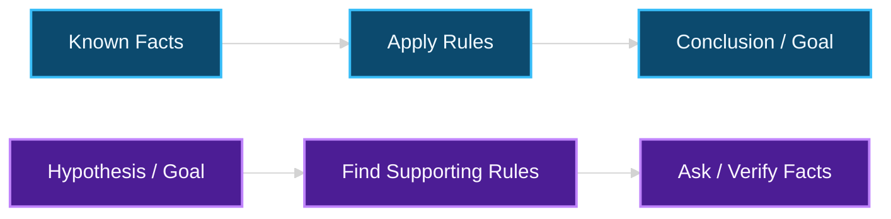

## Study Tracker

- [ ] Understand the fundamental differences between data, information, and knowledge.
    
- [ ] Differentiate conventional computer systems from Expert Systems.
    
- [ ] Identify and define the core components of an Expert System architecture.
    
- [ ] Compare Forward Chaining and Backward Chaining reasoning methods.
    
- [ ] Define Ontologies and their core components (Classes, Instances, Properties, Axioms).
    
- [ ] Recognize why modern AI (ML/DL) is superseding traditional rule-based and ontological systems.
    

## 1. The Knowledge Hierarchy (DIKW Pyramid)

Before building systems that reason, it is essential to categorize how systems process inputs.

- **Data:** Represents raw, uncontextualized facts, such as a standalone numerical value like "98.6".
    
- **Information:** Represents organized data with context, such as specifying "Temperature = 98.6°F".
    
- **Knowledge:** Represents meaningful insights and contextual understanding, such as deducing that "98.6°F is a normal body temperature".
    

## 2. Expert Systems Overview

An Expert System is a specialized computer program designed to simulate the decision-making ability of a human expert within a highly specific domain, such as medicine or engineering. It does not possess human cognition but operates by following strict IF-THEN rules to derive conclusions from encoded knowledge.

A common example is a medical symptom checker (like WebMD), where user-selected symptoms (fever, cough) prompt the system to suggest possible illnesses (flu, COVID-19).

### Conventional Systems vs. Expert Systems

|**Feature**|**Conventional Computer System**|**Expert System**|
|---|---|---|
|**Control Mechanism**|Data is used to control the program.|Knowledge is used to control the program.|
|**Storage Architecture**|Data and control mechanisms are stored together.|Knowledge is stored independently in an encoded representation.|
|**Transparency**|Cannot explain how a decision or conclusion is drawn.|Can explicitly explain how a decision or conclusion is drawn.|
|**Metadata**|Meta data _maybe_ present.|Meta data knowledge is _always_ present.|

## 3. Architecture of an Expert System




* **Knowledge Base:** The "brain" repository that stores facts (Declarative knowledge) and rules (Procedural knowledge) collected from domain experts.
* **Inference Engine:** The logical processing unit that applies reasoning (IF-THEN logic) to the knowledge base to derive conclusions.
* **Working Memory / Fact Base:** Temporary memory utilized by the inference engine to store current facts inputted during an active reasoning session.
* **User Interface:** The communication bridge allowing human users to interact, input data, and receive decisions.
* **Explanation Facility:** The module that ensures transparency by explaining *how* and *why* a specific conclusion was reached.
* **Knowledge Acquisition Module (Developer Interface):** The backstage control panel used by knowledge engineers and experts to safely input, update, or remove rules.
* **External Interfaces:** Optional links to fetch live data from external databases or software programs.

## 4. Inference Engine Reasoning: Forward vs. Backward Chaining

Reasoning in expert systems refers to the logical steps taken to draw conclusions from known facts and rules.



| **Feature** | **Forward Chaining** | **Backward Chaining** |
| --- | --- | --- |
| **Methodology** | Data-Driven Reasoning. | Goal-Driven Reasoning. |
| **Starts From** | Known facts or input data. | A specific goal or hypothesis. |
| **Moves Toward** | Inferring new facts until a conclusion is reached. | Verifying supporting facts to prove the goal. |
| **Common Use Case** | Monitoring and control systems. | Diagnostic and expert advice systems. |
| **Example** | From symptoms (Fever + Headache) → Find disease (Flu). | From suspected disease (Flu) → Check if symptoms fit. |

## 5. Historic Expert Systems & Limitations

> [!NOTE]
> **Key Historical Systems:**
> * **MYCIN:** Diagnosed blood infections and provided rule-based treatment suggestions.
> * **DENDRAL:** Predicted molecular structures using chemical spectra data.
> * **XCON:** Automated the configuration of computer systems, saving DEC $25 million.
> * **HEARSAY:** Utilized voice recognition for submarine sonar detection.
> 
> 

> [!WARNING]
> **Limitations:** While Expert Systems are efficient and consistent, they are incredibly rigid. They cannot learn from data to improve over time, are entirely dependent on manual rule creation, break easily with conflicting rules, and cannot scale to unstructured complex problems like natural language or vision.

## 6. Ontologies

An ontology is a structured, formalized way to represent knowledge. It maps out concepts, their properties, and the relationships between them so that computers can logically reason with the data. Gruber (1993) defines it as "A formal, explicit specification of a shared conceptualization".

* **Formal:** It follows a specific, logical structure and rules.
* **Explicit:** All terms and relationships are clearly defined.
* **Shared:** The structure is agreed upon by a group of users or systems.
* **Conceptualization:** It reflects an abstraction of a specific part of the real world.

### Core Ontology Components

| **Element** | **Description** | **Example (University Domain)** |
| --- | --- | --- |
| **Class** | A group or category of things. | Student, Course, Instructor. |
| **Instance** | A specific, individual member of a class. | John (a Student), CS101 (a Course). |
| **Property** | A feature or attribute belonging to a class. | hasName, hasCredits, hasAge. |
| **Relationship** | A logical link between classes or instances. | enrolledIn (Student → Course). |
| **Axiom** | A strict logical rule that must always remain true. | "A course must have at least 1 instructor". |
| **Restriction** | A constraint placed on specific properties or relationships. | "Students must enroll in ≤ 5 courses". |

### Real-World Applications of Ontologies

* **Healthcare:** *SNOMED CT* standardizes medical terminology across global systems.
* **E-commerce:** Powers Amazon's hierarchical product categories and search filters.
* **Search Engines:** Structures the Google Knowledge Graph to provide smart, contextual answers.

> [!CAUTION]
> **Challenges of Ontologies:** They require significant effort from domain experts to build and maintain. They are only effective for highly structured knowledge and fail when applied to unstructured data (images, audio) or probabilistic relationships involving uncertainty.

## 7. The Shift to Modern AI

Traditional Expert Systems and Ontologies lack flexibility, require intense manual labor to maintain, and fundamentally cannot learn or adapt from experience. Modern AI handles these gaps:

* **Machine Learning (ML):** Automatically learns patterns from data, scaling to new problems without explicit manual reprogramming (e.g., fraud detection).
* **Deep Learning (DL):** Utilizes neural networks to handle highly complex, unstructured data (e.g., facial recognition, ChatGPT).
* **Reinforcement Learning (RL):** Learns optimal decision-making pathways through simulated trial and error (e.g., autonomous driving, AlphaGo).
* **Hybrid AI Systems:** Combines symbolic reasoning from Ontologies with the data-driven learning capabilities of ML to enhance both adaptability and explainability.

## Technical Implementation

Below is a conceptual Java implementation representing how an Inference Engine utilizes Forward Chaining to derive a conclusion from known facts.

```Java
public class ExpertSystemInference {

    public static void main(String[] args) {
        // 1. Working Memory / Fact Base (Inputs provided by User Interface)
        boolean hasFever = true;
        boolean hasHeadache = true;
        boolean hasRunnyNose = true;

        // 2. Trigger Inference Engine
        String diagnosis = executeForwardChaining(hasFever, hasHeadache, hasRunnyNose);
        
        // 3. Output Conclusion
        System.out.println("System Diagnosis: " + diagnosis);
    }

    /**
     * Inference Engine logic applying Knowledge Base rules.
     */
    public static String executeForwardChaining(boolean fever, boolean headache, boolean runnyNose) {
        
        // Rule 1: Declarative and Procedural Knowledge encapsulated
        if (fever && headache && runnyNose) {
            return "Possible Flu"; 
        } 
        // Additional rules would follow...
        
        return "Insufficient data for diagnosis";
    }
}

```

## Active Recall Self-Check

> [!TIP]
> In a conventional system, data and control logic are stored together. In an Expert System, knowledge is stored independently in an encoded representation (the Knowledge Base), separate from the control logic (the Inference Engine).

> [!TIP]
> The Explanation Facility justifies decisions to the user by explaining *how* and *why* a certain conclusion was reached, which builds trust and ensures transparency.

> [!TIP]
> An Axiom is a foundational logical rule that must always be true (e.g., "A course must have at least 1 instructor"). A Restriction is a constraint placed on specific properties or relationships (e.g., "Students must enroll in ≤ 5 courses").

> [!TIP]
> Expert Systems rely on rigid, manually programmed rules, cannot learn from past experience, and struggle processing unstructured, noisy real-world data like images or natural language. ML and DL automatically learn patterns from unstructured data and improve with experience.
