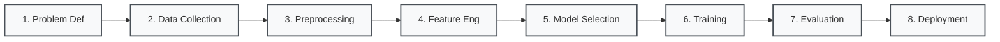
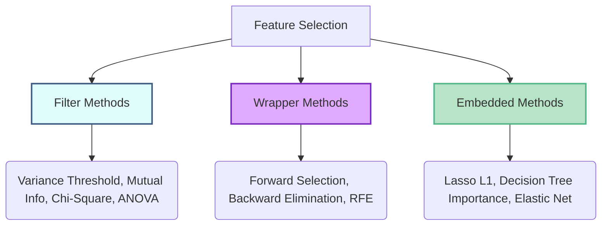

## Study Tracker

- [ ] Memorize the 8 sequential stages of a Machine Learning Pipeline.
    
- [ ] Apply data preprocessing techniques (Handling Missing Data, Encoding, Scaling).
    
- [ ] Differentiate between Filter, Wrapper, and Embedded feature selection methods.
    
- [ ] Understand Model Evaluation metrics and Cross-Validation (K-Fold).
    
- [ ] Identify the symptoms and solutions for Overfitting and Underfitting.
    

## 1. Overview of the Machine Learning Pipeline

A Machine Learning Pipeline is a formalized sequence of steps that transforms raw data into valuable predictions. It automates and streamlines data flow, model building, evaluation, and deployment.



## 2. Data Collection & Preprocessing

Raw data is often noisy, incomplete, or inconsistent. Preprocessing prepares this messy data for the algorithmic models.

### Data Collection

- **Structured Data:** Tabular format, easily searchable (Databases, CSV files).
    
- **Unstructured Data:** Free-form text, images, audio (Social media, emails).
    
- **Acquisition Tools:** BeautifulSoup, Scrapy (Web scraping); Postman, Python Requests (APIs); Apache NiFi, Talend (ETL).
    

### Core Preprocessing Steps

1. **Handling Missing Data:** Missing values must be resolved by filling them with the mean/average, filling with zero/"unknown", or dropping the row entirely.
    
2. **Scaling the Data:** Ensures all numerical features are treated equally by the model, preventing large-scale variables from dominating.
    
    - **Min-Max Scaling:** Rescales values between 0 and 1.
        
    - **Standardization (Z-score):** Centers the data around a mean of 0 with a standard deviation of 1.
        
3. **Converting Categorical Data:** Machines process numbers, not words.
    

|**Encoding Type**|**How It Works**|**Best Used For**|**Pros & Cons**|
|---|---|---|---|
|**Label Encoding**|Assigns a unique number to each category (e.g., Yes=1, No=0).|Ordinal data (e.g., Low, Medium, High).|**Pros:** Memory-efficient.<br><br>  <br><br>**Cons:** Implies a false mathematical order.|
|**One-Hot Encoding**|Creates a new binary (0/1) column for each category.|Nominal data (unordered, e.g., Country, Color).|**Pros:** No false ranking.<br><br>  <br><br>**Cons:** Can cause high dimensionality.|
|**Target Encoding**|Replaces category with the average value of the target variable.|High-cardinality features (e.g., Product IDs).|**Pros:** Efficient for large sets.<br><br>  <br><br>**Cons:** High risk of overfitting.|

## 3. Feature Engineering & Dimensionality Reduction

Feature engineering is the process of transforming raw data into meaningful features that improve model performance.

### Feature Selection Methods

Not all information is useful. Feature selection keeps only the most relevant columns.




|**Type**|**Uses Model?**|**Speed**|**Accuracy**|**Risk of Overfitting**|
|---|---|---|---|---|
|**Filter**|No|Fast|Moderate (may ignore interactions)|Low|
|**Wrapper**|Yes|Slow|High (model-driven)|High|
|**Embedded**|Yes|Medium|High|Medium|

### Feature Selection vs. Dimensionality Reduction

|**Aspect**|**Feature Selection**|**Dimensionality Reduction**|
|---|---|---|
|**Goal**|Select a subset of the original features.|Create new features by mathematically combining existing ones.|
|**Interpretability**|High (original feature names are retained).|Low (new features are abstract combinations, e.g., PC1).|
|**Examples**|Variance Threshold, SelectKBest.|PCA (Principal Component Analysis), Autoencoders.|

## 4. Model Selection, Training & Cross-Validation

### Model Selection

- **Classification:** Predicting a discrete category (e.g., Pass/Fail). Algorithms: Logistic Regression, Decision Trees.
    
- **Regression:** Predicting a continuous number (e.g., Marks, Salary). Algorithms: Linear Regression.
    
- **Clustering:** Grouping unlabelled data. Algorithms: K-Means.
    

### Hyperparameter Tuning

Hyperparameters are pre-defined settings (e.g., `max_depth` in Decision Trees, `n_neighbors` in KNN) adjusted to improve performance.

- **Grid Search:** Exhaustively tries all possible combinations of provided values.
    
- **Random Search:** Samples random combinations from a defined range (computationally faster).
    

### K-Fold Cross-Validation

Evaluates model consistency by splitting data into multiple folds rather than relying on a single train/test split.

> [!NOTE]
> 
> **How K-Fold Works:**
> 
> 1. Split data into K equal parts (folds).
>     
> 2. Train on K-1 folds, and test on the 1 remaining fold.
>     
> 3. Repeat K times, changing the test fold each iteration.
>     
> 4. Calculate the average score for a highly reliable performance estimate.
>     

## 5. Model Evaluation & Fitting

Evaluating on unseen test data determines if the model genuinely learned patterns or just memorized the training data.

### Evaluation Metrics

- **Classification:** Accuracy (overall correctness), Precision (correctness of positive predictions), Recall (coverage of actual positives), F1 Score (balance of Precision and Recall).
    
- **Regression:** MAE (Mean Absolute Error), MSE (Mean Squared Error), R-Squared (% of variance explained).
    

### Overfitting vs. Underfitting

|**State**|**Training Accuracy**|**Test Accuracy**|**Definition**|**How to Fix**|
|---|---|---|---|---|
|**Underfitting**|Low (~60%)|Low (~60%)|Model is too simple; failed to learn the patterns.|Use a more complex model, add features, train longer.|
|**Overfitting**|High (~100%)|Low (~60-70%)|Model is too complex; memorized noise and outliers.|Use a simpler model, apply Regularization, add training data, use Early Stopping.|

## 6. Deployment & Maintenance

Deployment transitions a trained model into a production environment (e.g., cloud, browser, server).

> [!IMPORTANT]
> 
> **Deployment Components:**
> 
> - **Trained Model File:** Serialized files like `.pkl`, `.joblib`, or `.h5`.
>     
> - **Prediction Script:** Python code that loads the model and processes inputs.
>     
> - **API/Interface:** The frontend where users interact (e.g., a chatbot or web form).
>     
> - **Post-Deployment:** Continuous monitoring is required to track accuracy degradation, handle bugs, and retrain the model with fresh data.
>     

## Technical Implementation

Below is a Python representation of an automated Machine Learning Pipeline using `scikit-learn`. It demonstrates combining data preprocessing (Scaling) and model training into a single deployable object.


```Python
from sklearn.pipeline import Pipeline
from sklearn.preprocessing import StandardScaler
from sklearn.ensemble import RandomForestClassifier
from sklearn.model_selection import train_test_split
from sklearn.metrics import accuracy_score

# Assume 'X' is our feature dataset and 'y' is our target labels
# X_train, X_test, y_train, y_test = train_test_split(X, y, test_size=0.2, random_state=42)

# 1. Define the Pipeline steps
# Step A: Preprocessing (Standardization)
# Step B: Model Selection (Random Forest Classifier)
ml_pipeline = Pipeline([
    ('scaler', StandardScaler()),
    ('classifier', RandomForestClassifier(n_estimators=100, max_depth=5))
])

# 2. Model Training (Pipeline automatically scales data, then trains the model)
# ml_pipeline.fit(X_train, y_train)

# 3. Model Evaluation (Pipeline automatically scales test data, then predicts)
# predictions = ml_pipeline.predict(X_test)
# print("Model Accuracy:", accuracy_score(y_test, predictions))

# The 'ml_pipeline' object can now be exported as a .pkl file for Deployment.
```

## Active Recall Self-Check

> [!TIP]
> 
> Label Encoding converts categories into sequential numbers (e.g., 0, 1, 2), which is good for ordinal data but can falsely imply mathematical ranking. One-Hot Encoding creates a new binary column for each category, avoiding false ranking but potentially causing high dimensionality.

> [!TIP]
> 
> Filter methods select features based on statistical tests independently of the ML algorithm (fast, low overfitting risk). Wrapper methods use the actual predictive model to evaluate feature combinations (slower, highly accurate, but high overfitting risk).

> [!TIP]
> 
> The model is **Overfitting**. It has memorized the training data's noise. To fix it, you can use a simpler model, apply regularization, use cross-validation, or add more training data.

> [!TIP]
> 
> A standard split relies on a single slice of data, which might yield a "lucky" or "unlucky" accuracy score. K-Fold tests the model across multiple different subsets of the data, providing a much more reliable and stable performance estimate.