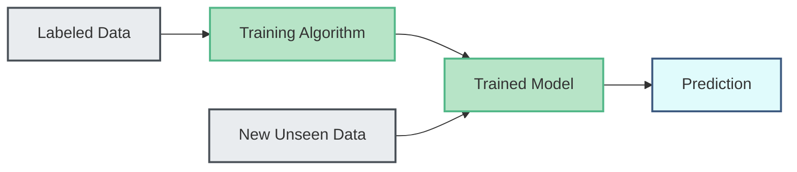

## Study Tracker

- [ ] Define Supervised Learning and its primary objectives.
    
- [ ] Understand and apply Linear Regression and the Coefficient of Determination ($R^2$).
    
- [ ] Differentiate Logistic Regression from Linear Regression and understand the Sigmoid function.
    
- [ ] Calculate Euclidean distance and apply the K-Nearest Neighbors (KNN) algorithm.
    
- [ ] Construct Decision Trees and evaluate node purity using the Gini Index.
    
- [ ] Understand Support Vector Machines (SVM), hyperplanes, margins, soft margins, and the Kernel trick.
    

## 1. Introduction to Supervised Learning

Supervised learning is a machine learning paradigm where a model is trained on a labeled dataset. The input data is explicitly paired with the correct output. The algorithm's goal is to learn the mathematical mapping between inputs and outputs to make accurate predictions on new, unseen data.




## 2. Regression Models

### Linear Regression

Linear regression assumes a linear relationship between the input variables ($x$) and the single continuous output variable ($y$). The objective is to find a "best fit line" where the total prediction error across all data points is as small as possible.

- **Simple Linear Regression:** Utilizes a single input variable (e.g., predicting weight based on height).
    
    $$y = \beta_0 + \beta_1x + \epsilon$$
    
- **Multiple Linear Regression:** Utilizes multiple input variables ($k$ independent variables).
    
    $$y = \beta_0 + \beta_1x_1 + \beta_2x_2 + ... + \beta_kx_k + \epsilon$$
    

> [!NOTE]
> 
> **Coefficient of Determination ($R^2$):** Explains the fraction of variation captured by the estimated model.
> 
> $$R^2 = \frac{TSS - SSE}{TSS}$$
> 
> Where $TSS$ (Total Sum of Squares) is the total variance in $y$, and $SSE$ (Sum of Squares of Error) is the variance not explained by the model.

### Logistic Regression

Logistic regression is used when the response variable is dichotomous/binary (e.g., Yes/No, Pass/Fail, True/False). Because linear regression can output values outside the $[0, 1]$ range, logistic regression employs the **Sigmoid function** to map outputs to probabilities.

$$S(x) = \frac{1}{1 + e^{-x}}$$

The model calculates the probability of belonging to a category. A cutoff value (typically 0.5) is then used to assign the final class. The transformation yields the **Logit**:

$$log(\frac{P}{1-P}) = \beta_0 + \beta_1x_1 + ... + \beta_px_p$$

### Linear vs. Logistic Regression

|**Feature**|**Linear Regression**|**Logistic Regression**|
|---|---|---|
|**Target Variable**|Continuous (Quantitative)|Categorical / Binary (Qualitative)|
|**Output**|A continuous numeric value|A probability between 0 and 1|
|**Function**|Straight line (Best Fit)|S-curve (Sigmoid function)|

## 3. K-Nearest Neighbors (KNN)

KNN is a non-parametric algorithm that classifies new data points based on their proximity to existing training data in a geometric space.

### Euclidean Distance

The fundamental metric for KNN is the straight-line distance between two points.

- **2D Space:** $d = \sqrt{(x_2 - x_1)^2 + (y_2 - y_1)^2}$
    
- **3D Space:** $d = \sqrt{(x_2 - x_1)^2 + (y_2 - y_1)^2 + (z_2 - z_1)^2}$
    

### Algorithm Logic

1. Calculate the Euclidean distance between the new point and all training points.
    
2. Select the $k$ closest data points.
    
3. **For Classification:** Assign the class that is most frequent among the $k$ neighbors (Majority Vote).
    
4. **For Regression:** Calculate the average of the target values of the $k$ neighbors.
    

> [!TIP]
> 
> Hyperparameter optimization is required to select the optimal value of $k$ to avoid overfitting or underfitting.

## 4. Decision Trees (CART)

Classification and Regression Trees (CART) use a tree of multiple decision rules derived from data features. It relies on recursive partitioning to split the training set into sub-groups.

Code snippet

```
graph TD
    classDef root fill:#ced4da,stroke:#343a40,stroke-width:2px;
    classDef internal fill:#e9ecef,stroke:#495057,stroke-width:2px;
    classDef leaf fill:#b7e4c7,stroke:#52b788,stroke-width:2px;

    R[Root Node: Entire Dataset]:::root --> I1[Internal Node: Feature Split]:::internal
    R --> I2[Internal Node: Feature Split]:::internal
    I1 --> L1[Leaf Node: Class A]:::leaf
    I1 --> L2[Leaf Node: Class B]:::leaf
    I2 --> L3[Leaf Node: Class A]:::leaf
```

### Node Purity and the Gini Index

The algorithm splits nodes based on **homogeneity** or **purity**. A pure node contains instances of only one class.

The **Gini Index (Gini Impurity)** measures how mixed a dataset is. It ranges from 0 (perfectly pure) to 1 (completely impure). The algorithm prefers attributes that result in the lowest Gini Index.

$$Gini = 1 - \sum(p(i)^2)$$

_Where $p(i)$ is the probability of a specific class._

> [!IMPORTANT]
> 
> If a dataset has 30% "Yes" and 70% "No":
> 
> $Gini = 1 - (0.3)^2 - (0.7)^2 = 1 - 0.09 - 0.49 = 0.42$

## 5. Support Vector Machines (SVM)

SVM finds the optimal **Decision Boundary (Hyperplane)** that separates different classes while maximizing the **Margin**.

- **Hyperplane:** An $(n-1)$-dimensional subspace (e.g., a line in 2D space, a plane in 3D space).
    
- **Margin:** The perpendicular distance from the hyperplane to the closest data points (Support Vectors). SVM seeks to maximize this distance.
    

### Linear Non-Separable Cases

Real-world data is rarely perfectly separable. SVM handles this via two mechanisms:

1. **Soft Margin:** Tolerates a few misclassified data points (dots on the wrong side of the margin or boundary) to prevent overfitting and find a generalized line.
    
2. **Kernel Trick:** Applies mathematical transformations to create new features, projecting data into higher dimensions to find non-linear decision boundaries (e.g., `linear`, `poly`, `rbf`).
    

## Technical Implementation

Below is a Java implementation demonstrating the logic of calculating the Euclidean distance, which is the foundational mathematical operation powering the K-Nearest Neighbors (KNN) algorithm.

```Java
public class KNNLogic {

    /**
     * Calculates the Euclidean distance between two data points in n-dimensional space.
     * * @param point1 Array representing the feature coordinates of the first point.
     * @param point2 Array representing the feature coordinates of the second point.
     * @return The Euclidean distance as a double.
     */
    public static double calculateEuclideanDistance(double[] point1, double[] point2) {
        if (point1.length != point2.length) {
            throw new IllegalArgumentException("Data points must have the same number of dimensions.");
        }

        double sumOfSquaredDifferences = 0.0;
        
        // Iterate through each feature/dimension
        for (int i = 0; i < point1.length; i++) {
            double difference = point2[i] - point1[i];
            sumOfSquaredDifferences += Math.pow(difference, 2);
        }

        return Math.sqrt(sumOfSquaredDifferences);
    }

    public static void main(String[] args) {
        // Example: 2D space coordinates (e.g., Age and Height)
        double[] newPatient = {38.0, 5.5};
        double[] historicalPatient = {34.0, 5.9};

        double distance = calculateEuclideanDistance(newPatient, historicalPatient);
        System.out.printf("Euclidean Distance: %.4f\n", distance);
    }
}
```

## Active Recall Self-Check

> [!TIP]
> 
> A standard linear equation can output values ranging from negative to positive infinity. The Sigmoid function maps these outputs strictly to a range between 0 and 1, allowing the result to be interpreted as a probability for categorical classification.

> [!TIP]
> 
> For classification, KNN looks at the $k$ closest neighbors and assigns the most frequent class (majority vote). For regression, it calculates the numerical average of the target variables of those $k$ closest neighbors.

> [!TIP]
> 
> A Gini Index of 0.0 indicates perfect purity. This means that all samples in the resulting child nodes belong to the exact same class, representing an ideal split.

> [!TIP]
> 
> When data is not linearly separable in its original space, the Kernel Trick mathematically transforms the data into higher dimensions, allowing the SVM to discover a non-linear decision boundary without explicitly calculating the coordinates in the higher-dimensional space.